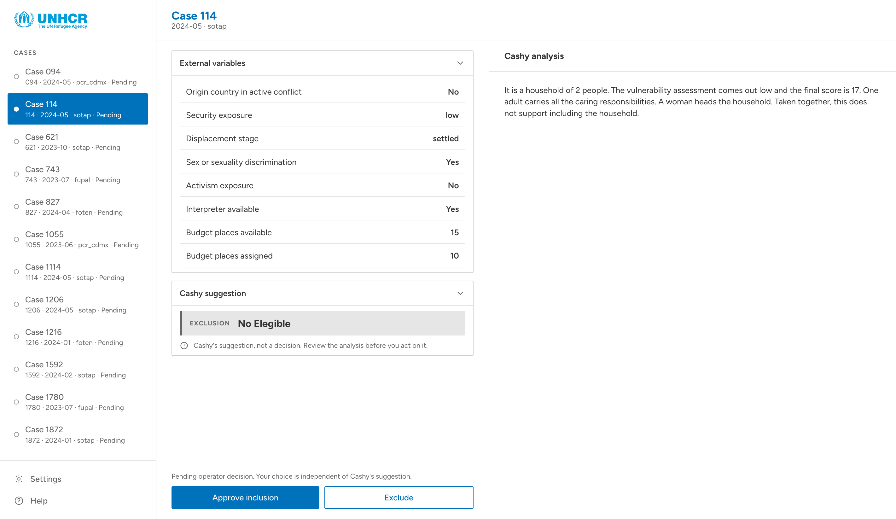
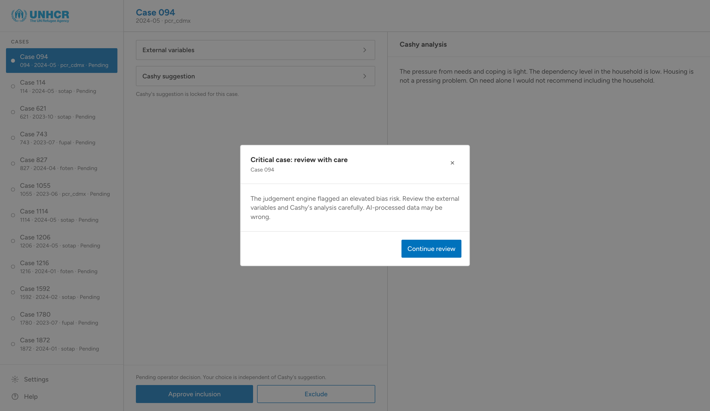
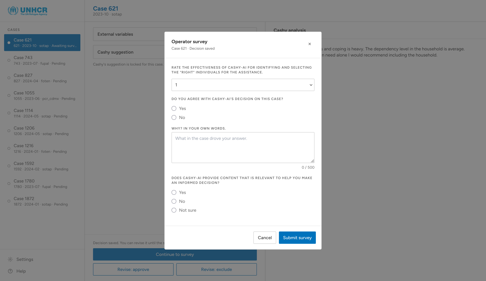

# Data & Innovation for Refugee Inclusion Hackathon

Repository for the **"2026 Data & Innovation for Refugees and Inclusion"** hackathon promoted by [UNHCR](https://www.unhcr.org/) and the [University of Trento](https://www.unitn.it/).

This project explores how to preserve meaningful human oversight in AI-assisted cash-targeting decisions by combining a **Judgement Engine** with a **Cognitive-Forcing Interface**.

## Problem

Cashy is an AI decision-support prototype for humanitarian cash targeting. It provides a predicted score, vulnerability category, inclusion/exclusion recommendation, and a written explanation based on household data.

The final decision, however, remains the sole responsibility of a human caseworker.

This creates a specific risk: **automation bias and over-reliance on AI**. Research shows that operator trust in AI is inherently volatile: caseworkers exhibit _algorithm appreciation_ by preferring AI predictions initially, yet quickly switch to _algorithm aversion_ after observing a single error. Furthermore, displaying AI explanations can inflate trust regardless of accuracy, leading operators to passively accept incorrect advice.

The goal is therefore not simply to maximize agreement with the AI, but to support **appropriate reliance**:

- **Correct override**: Cashy is wrong and the caseworker overrides it;
- **Over-reliance**: Cashy is wrong and the caseworker accepts it;
- **Correct acceptance**: Cashy is correct and the caseworker accepts it;
- **Under-reliance**: Cashy is correct and the caseworker overrides it.

> **Institutional Reference Standard**: Throughout this project, "correct" means agreement with the operation's recorded determination. This is the institutional reference standard for the exercise, not ground truth about a household's needs.

## Our approach

Our solution introduces an **Oversight Layer** between Cashy's recommendation and the final human decision. Instead of retraining the underlying prediction model, the system prioritizes caseworker engagement through cognitive forcing mechanisms.

The interface actively measures whether the caseworker:

- Inspected the case context;
- Considered Cashy's reasoning;
- Considered Cashy's recommendation separately;
- Recognized potential discrepancies;
- Made an independent judgement;
- Provided a reason for that judgement.

The system also monitors aggregated behavior over time so that a loss of human oversight becomes visible to the institution before becoming systemic.

## Workflow pipeline

```txt
                 START
                   │
                   ▼
             ┌───────────┐  data + context  ┌───────────┐
             │ Interview ├─────────────────►│   Cashy   │
             └─────┬─────┘                  └─────┬─────┘
                   │                              │
            standard output                  cashy output
                   │                              │
                   └──────────────┐┌──────────────┘
                                  ▼▼
                          ┌───────────────┐
                          │   Judgement   │
                          │    Process    │
                          └─────▲───┬─────┘
                                │   │
                                │   ▼
                          ┌─────┴───┬─────┐
                          │   Operator    │
                          │    Survey     │
                          └───────┬───────┘
                                  │
                                  ▼
                                 STOP  

```

1. **Interview**: Registration staff interview the household regarding identity, vulnerability, health, housing, and basic needs, recording interviewer observations;
2. **Scorecard**: Rule-based logic processes interview data to generate scores, vulnerability tiers, and administrative checks;
3. **Cashy Recommendation**: The AI model predicts scores and eligibility recommendations alongside a natural-language rationale;
4. **Judgement Engine**: Background Python services compare Scorecard inputs against Cashy's predictions to assess agreement and flag divergence risks;
5. **Operator Survey & Decision**: The operator completes a mandatory survey before submitting an independent determination.

## Decision process architecture

The judgement process is designed around a key principle from the challenge brief: **Cashy's reasoning and its final answer must be treated as separate outputs**. A single "I agree" interaction is not sufficient evidence that the operator actually evaluated the recommendation.

### Judgement Engine & Discrepancy Detection

The **Judgement Engine** computes semantic and contextual consistency between Scorecard indicators and Cashy's predictions. When semantic match scores fall below configured thresholds (e.g., threshold value of 75), the system flags the case with `show_warning: true` to trigger active interface interventions.

### Attention and cognitive forcing

The interface adapts its behavior when signals suggest the operator may be accepting Cashy's recommendation without sufficient analysis:

- **Critical Case Warning Modals**: Triggered when Cashy's output conflicts with Scorecard data or exhibits low semantic agreement, forcing the caseworker to acknowledge potential AI error;
- **Forced Reflection Prompts**: Interactive confirmations required before submitting decisions on high-risk cases;
- **Separate Output Rating**: Independent evaluation controls for Cashy's reasoning versus its final recommendation;
- **Attention Checks**: Detection mechanisms triggered by suspiciously fast click rates or repetitive unread interactions;
- **Context-Sensitive Thresholds**: Dynamic risk triggers based on historical classes of cases where model reliability varies.

### Operator survey architecture

The survey is part of the core decision process rather than a post-hoc questionnaire. Feedback is collected for both accepted and overridden recommendations, turning feedback into a cognitive forcing mechanism.

Completing the survey is **mandatory before the judgement becomes final** and captures:

- **Perceived Effectiveness**: A 1-to-5 scale rating Cashy's utility in identifying appropriate candidates;
- **Explicit Agreement**: Binary concurrence indicator (`Yes` / `No`);
- **Qualitative Rationale**: Mandatory free-text input (up to 500 characters) documenting key decision drivers;
- **Explanatory Relevance**: Tri-state rating (`Yes` / `No` / `Not sure`) evaluating whether Cashy's rationale provided meaningful context;

## Dashboard


The interface employs a three-pane design focused on transparency, bias awareness, and cognitive forcing:

- **Left Sidebar**: Case list queue with status indicators (`Pending`, `Awaiting survey`);
- **Center Pane**: External variables accordion (household metrics, security exposure) and primary decision buttons (`Approve inclusion`, `Exclude`);
- **Right Pane**: Cashy's natural-language rationale and contextual explanations.

### Screenshots

| | |
|--|--|
|  |  |
|  |  |

> [!NOTE]
> Information about dashboard's development and deplyment can be found inside [`dashboard_demo/README.md`](dashboard_demo/README.md) file.

## Dataset Analysis & Limitations

Exploratory analysis of the synthetic dataset (`S8.synthetic_cashy_sample.csv`) demonstrated that eligibility outcomes are not strongly predicted by Scorecard factors alone. `FinalScore` distributions for included vs. excluded cases overlap significantly across deciles, yielding an Area Under the Curve (AUC) of 0.529.

## Feasibility of implementation

The solution requires zero retraining or replacement of existing predictive models, operating purely as an instrumentation and oversight layer.

## Acknowledgements

This project was developed by **Team Rocket**, for the **2026 Data & Innovation for Refugee Inclusion Hackathon**, organized by **UNHCR Innovation** and the **University of Trento**.

We thank the challenge organizers and contributors for providing the synthetic dataset, challenge materials, research findings, and experimental framework.

### Tools & Resources

- **[Python](https://www.python.org/) & [Flask](https://flask.palletsprojects.com/)**: Used to build the backend REST API and decision logic;
- **[Jupyter Notebook](https://jupyter.org/)**: Used for data analysis and for prototyping the Judgement Engine logic;
- **[Tailwind CSS](https://tailwindcss.com/)**: Used for styling the interactive dashboard UI;
- **[ASCIIFlow](https://asciiflow.com/)**: Used for creating and refining the workflow architecture diagrams.

## References

- Bucinca, Z., Malaya, M. B., & Gajos, K. Z. (2021). To Trust or to Think: Cognitive Forcing Functions Can Reduce Overreliance on AI in AI-Assisted Decision Making. _Proc. ACM Hum.-Comput. Interact._, 5(CSCW1), 1–21.
- Dietvorst, B. J., Simmons, J. P., & Massey, C. (2015). Algorithm aversion: People erroneously avoid algorithms after seeing them err. _Journal of Experimental Psychology: General_, 144(1), 114–126.
- Logg, J. M., Minson, J. A., & Moore, D. A. (2019). Algorithm appreciation: People prefer algorithmic to human judgment. _Organizational Behavior and Human Decision Processes_, 151, 90–103.
- O'Brien, H. L., & Toms, E. G. (2008). What is user engagement? A conceptual framework for defining user engagement with technology. _J. Am. Soc. Inf. Sci._, 59(6), 938–955.
- Parasuraman, R., & Manzey, D. H. (2010). Complacency and bias in human use of automation: An attentional integration. _Human Factors_, 52(3), 381–410.
- UNHCR Innovation. _Cashy Oversight Challenge and hackathon materials_.
- Yu, L., Li, Y., & Fan, F. (2023). Employees' appraisals and trust of artificial intelligences' transparency and opacity. _Behavioral Sciences_, 13(4), 344.
